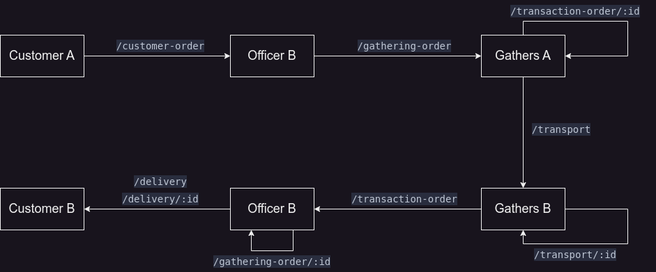

# Magic Post

## Routes

Description of routes in `routes/` folder

- Transaction offices: Điểm giao dịch
- Gathering point: Điểm tập kết

### For admin, manager

| Routes                     | Description                                                      | Auth?                      |
| -------------------------- | ---------------------------------------------------------------- | -------------------------- |
| /api                       | API endpoint - Fetch data from server                            |                            |
| /login                     | Login for staff, admin                                           |                            |
| /tracking                  | For customer to track their order                                |                            |
| /profile                   | Display, edit user information                                   | logged                     |
| /statistics                | Display statistic based on role                                  | all logged                 |
| /admin                     | View and manage transaction offices, gathering point, staffs,... | admin                      |
| /admin/transaction-offices | Manage transaction offices for admin                             | admin                      |
| /admin/gathering-points    | Manage gathers for admin                                         | admin                      |
| /manage-staffs             | Manage staffs (create account ...) for staff                     | lead-officer, lead-gathers |

### For normal staffs

| Route                  | Description                                                        | Auth?   | Equal function                                               |
| ---------------------- | ------------------------------------------------------------------ | ------- | ------------------------------------------------------------ |
| /customer-order        | Receive orders of customer                                         | officer | Ghi nhận hàng cần gửi của khách                              |
| /gathering-order       | Create/view all order to send to gathering points                  | officer | Tạo đơn chuyển hàng gửi đến điểm tập kết                     |
| /transaction-order/:id | Confirm/view specific order come from transactions offices         | gathers | Xác nhận (đơn) hàng đến từ điểm giao dịch                    |
| /transport             | Create/view all transport orders to ship to other gathering points | gathers | Tạo đơn chuyển hàng đến điểm tập kết đích                    |
| /transport/:id         | Confirm/view specific complete transport to gathering point        | gathers | Xác nhận đơn hàng nhận về từ điểm tập kết khác               |
| /transaction-order     | Create order to send to transaction office                         | gathers | Tạo đơn chuyển hàng đến điểm giao dịch đích                  |
| /gathering-order/:id   | Confirm/view specific order come from gathering points             | officer | Xác nhận (đơn) hàng về từ điểm tập kết                       |
| /delivery              | Create order delivery                                              | officer | Tạo đơn hàng cần chuyển đến tay người nhận                   |
| /delivery/:id          | Confirm the order is received/denied by customer                   | officer | Xác nhận hàng đã chuyển/không chuyển được đến tay người nhận |

## Flows

Normal flow (routes used) from receive order to delivery package to customer:



## Developing

Once you've created a project and installed dependencies with `npm install` (recommend `pnpm install`), start a development server:

```bash
npm run dev

# or start the server and open the app in a new browser tab
npm run dev -- --open
```

## Building

To create a production version of your app:

```bash
npm run build
```

You can preview the production build with `npm run preview`.

> To deploy your app, you may need to install an [adapter](https://kit.svelte.dev/docs/adapters) for your target environment.
